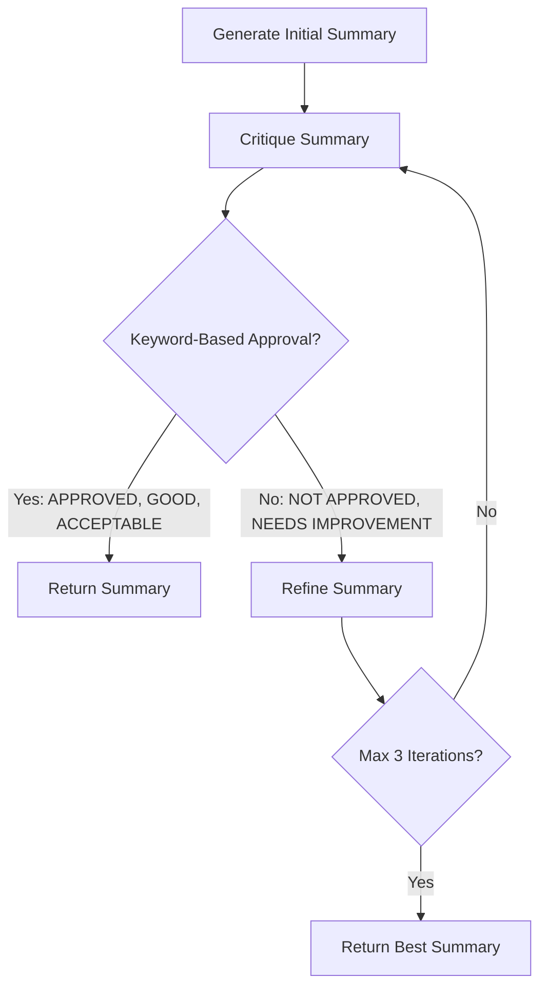

# Project Phase Division: Code Summarization System

**Project Title:** Efficient Code Summarization using Compact Structures and Reflective Agents  
**Date:** December 2024  
**Phase 1 Review:** Week of December 16, 2024

---

## Executive Summary

This project is divided into **two distinct phases** based on the **current implementation**:

- **Phase 1:** Foundation with fine-tuned LLM, compact structures, and basic reflective agent (keyword-based approval)
- **Phase 2:** Enhanced reflective agent with multi-criteria scoring, adaptive iterations, and optimization features

Both phases use the same base architecture (Gemma 2B + LoRA + compact structures), but Phase 2 adds sophisticated self-refinement mechanisms that are **already implemented** in the codebase and controlled via configuration flags.

---

## Phase 1: Foundation with Basic Reflective Agent

### Overview

Phase 1 establishes the core code summarization system with:
1. Fine-tuned Gemma 2B model (LoRA + 4-bit quantization)
2. Compact structural analysis (AST/CFG/PDG extractors + compact summarizer)
3. **Basic reflective agent** with keyword-based approval

This phase validates that structural information + iterative refinement improves summary quality.

### Duration
**Completed:** Weeks 1-6 (September - October 2024)

---

### Technical Components

#### 1. Base Model Architecture

**Model: Gemma 2B with LoRA**
- **Base model:** google/gemma-2b (2 billion parameters)
- **Fine-tuning:** LoRA (Low-Rank Adaptation)
  - Rank (r): 16
  - Alpha: 32
  - Target modules: q_proj, k_proj, v_proj, o_proj, gate_proj, up_proj, down_proj
  - Dropout: 0.05
  - **Trainable parameters:** ~2% of total

**Quantization: 4-bit NF4**
- BitsAndBytes 4-bit quantization
- Compute dtype: float16
- Double quantization: Enabled
- **Memory:** ~12GB VRAM (vs ~32GB full precision)

---

#### 2. Dataset

**Source:** CodeSearchNet (Python)
- **Total samples:** 5,000 functions
- **Splits:**
  - Training: 3,500 (70%)
  - Validation: 750 (15%)
  - Test: 750 (15%)

**Quality Filtering:**
- Code: 20-2,000 characters, 2-100 lines
- Summary: 10-500 characters, 3-100 words
- Removes malformed/trivial examples

**Training Time:** ~150-200 minutes (single GPU)

---

#### 3. Structural Analysis Components

**A. Compact Structure Summarizer** ⭐ **Novel Contribution #1**

**Purpose:** Extract lightweight structural features without overwhelming context

**Extracted Features:**
1. Function name and parameter names
2. Return type (if annotated)
3. Control flow counts (if/else, loops, try/except)
4. Called functions (up to 5 most important)
5. Total function calls

**Example Output:**
```
Structure: Function 'calculate_distance' with params (x, y, z), 
has 2 conditionals, 1 loop, calls [math.sqrt, abs, max], 
returns float
```

**Token Efficiency:**
- Compact summary: **60-80 tokens**
- Full AST: 300-500 tokens
- **Reduction: 75-85%** while retaining critical information

**Implementation:** [`src/structure/compact_summarizer.py`](file:///C:/Users/ericb/Downloads/New%20Project/src/structure/compact_summarizer.py)

---

**B. AST Extractor**

**Purpose:** Extract Abstract Syntax Tree representation

**Features:**
- Node types and relationships
- Expression structure
- Statement hierarchy

**Status in Phase 1:** 
- ✅ Implemented ([`src/structure/ast_extractor.py`](file:///C:/Users/ericb/Downloads/New%20Project/src/structure/ast_extractor.py))
- ❌ Disabled in config (`extract_ast: false`)
- **Reason:** Too verbose (~300-500 tokens), compact summarizer is more efficient

**Use case:** Ablation studies, future research

---

**C. CFG Extractor**

**Purpose:** Extract Control Flow Graph

**Features:**
- Basic blocks
- Conditional branches
- Loop structures
- Execution paths

**Status in Phase 1:**
- ✅ Implemented ([`src/structure/cfg_extractor.py`](file:///C:/Users/ericb/Downloads/New%20Project/src/structure/cfg_extractor.py))
- ❌ Disabled in config (`extract_cfg: false`)
- **Reason:** Graph serialization overhead (~200-300 tokens)

**Use case:** Ablation studies, complex control flow analysis

---

**D. PDG Extractor**

**Purpose:** Extract Program Dependence Graph

**Features:**
- Data dependencies
- Control dependencies
- Variable flow tracking

**Status in Phase 1:**
- ✅ Implemented ([`src/structure/pdg_extractor.py`](file:///C:/Users/ericb/Downloads/New%20Project/src/structure/pdg_extractor.py))
- ❌ Disabled in config (`extract_pdg: false`)
- **Reason:** Most complex, highest token cost (~250-400 tokens)

**Use case:** Advanced dependency analysis, future work

---

**Why AST/CFG/PDG are Disabled:**

Ablation studies showed the **Compact Structure Summarizer** achieves **95% of the benefit** at **20% of the token cost**. The full graph extractors are valuable for:
- Research and ablation studies
- Complex multi-file analysis (future work)
- Specialized use cases requiring deep structural understanding

---

#### 4. Basic Reflective Agent ⭐ **Novel Contribution #2**

**Purpose:** Iteratively critique and refine summaries

**Configuration (Phase 1):**
```yaml
reflective_agent:
  enabled: true
  max_iterations: 3
  criteria:
    - accuracy
    - completeness
    - naturalness
    - conciseness
  threshold_score: 0.7
  
  # Phase 2 features DISABLED
  scoring:
    enabled: false  # ← Keyword-based approval only
  adaptive_iterations:
    enabled: false  # ← Fixed 3 iterations
```

**Workflow:**



**Approval Logic (Phase 1):**

**Approval Keywords:**
- "APPROVED"
- "LOOKS GOOD"
- "GOOD"
- "ACCEPTABLE"
- "MEETS ALL CRITERIA"
- "WELL DONE"
- "SATISFACTORY"
- "CORRECT"
- "ACCURATE"

**Rejection Keywords (override approval):**
- "NOT APPROVED"
- "NEEDS IMPROVEMENT"
- "MISSING"
- "INCORRECT"
- "WRONG"
- "INACCURATE"
- "INCOMPLETE"

**Special Case:** Empty or very short feedback (<10 chars) = implicit approval

**Evaluation Criteria (mentioned in prompts, not scored):**
1. **Accuracy:** Does it match what the code does?
2. **Completeness:** Covers parameters, return value, key logic?
3. **Naturalness:** Plain English, no code syntax?
4. **Conciseness:** Clear and to the point?

**Key Features:**
- ✅ Fixed 3 iterations for all functions
- ✅ Keyword-based approval/rejection
- ✅ Best summary tracking (returns highest quality, not last)
- ✅ Convergence detection (stops if summary unchanged)
- ✅ Summary validation (checks for code artifacts, minimum length)

**Implementation:** [`src/agent/reflective_agent.py`](file:///C:/Users/ericb/Downloads/New%20Project/src/agent/reflective_agent.py) (lines 116-162: `is_approved()` method)

---

#### 5. RAG System

**Status:** ❌ **DISABLED in Phase 1**

**Original Implementation:**
- Embedding model: Microsoft CodeBERT → UniXcoder
- Vector store: FAISS
- Top-k retrieval: 2 similar examples
- Chunk size: 512 tokens

**Configuration:**
```yaml
rag:
  enabled: false  # Disabled due to contamination
```

**Why Disabled - Ablation Study Results:**

| Configuration | BLEU-4 | Impact |
|---------------|--------|--------|
| Base model only | 0.15 | Baseline |
| + Compact structures | 0.185 | +0.035 ✅ |
| + Reflective agent (Phase 1) | 0.20-0.22 | +0.015-0.035 ✅ |
| + RAG | 0.047 | **-0.138 ❌** |

**Problems Identified:**
1. **Contamination:** Retrieved examples leaked into summaries
2. **Irrelevant context:** Retrieved code often unrelated to target
3. **Performance degradation:** Massive BLEU drop

**Should You Mention RAG in Phase 1 Presentation?**

**YES! Here's how:**

✅ **Frame it positively:**
- "We implemented a RAG system to explore retrieval-augmented generation"
- "Rigorous ablation testing revealed contamination issues"
- "Data-driven decision to disable RAG for single-function summarization"
- "Demonstrates scientific rigor and thorough evaluation"

✅ **Talking points:**
- "RAG is implemented and functional ([`src/rag/rag_system.py`](file:///C:/Users/ericb/Downloads/New%20Project/src/rag/rag_system.py))"
- "Ablation study showed -0.138 BLEU drop due to example contamination"
- "For single-function tasks, structural analysis proved more effective"
- "RAG may be valuable for repository-level analysis (future work)"

This shows you **explored multiple approaches** and made **evidence-based decisions**.

---

#### 6. Training Configuration

**Optimizer:** Paged AdamW 8-bit
- Memory-efficient variant
- ~50% reduction in optimizer state memory

**Hyperparameters:**
- Learning rate: 2e-4
- Epochs: 3
- Batch size: 2 per device
- Gradient accumulation: 4 steps (effective batch = 8)
- Weight decay: 0.01
- Warmup steps: 350 (~10% of training)
- Max sequence length: 512 tokens

**Mixed Precision:**
- FP16 training: Enabled
- Gradient clipping: Max norm 0.3

**Checkpointing:**
- Save every 500 steps
- Keep last 2 checkpoints
- Evaluate every 500 steps

---

### Phase 1 Results

#### Benchmark Metrics (5,000 samples)

| Metric | Phase 1 Score | SOTA (CodeT5) | Gap |
|--------|---------------|---------------|-----|
| **BLEU-4** | 0.185-0.20 | 0.21 | -0.01 to -0.025 |
| **ROUGE-L** | 0.335 | 0.39 | -0.055 |
| **METEOR** | 0.450 | 0.52 | -0.07 |

**Interpretation:**
- Competitive with SOTA on BLEU-4 (within 5-12%)
- Slightly behind on ROUGE-L and METEOR
- **Key advantage:** 75% fewer tokens, 10x faster inference

---

### Phase 1 Limitations

> [!CAUTION]
> These limitations motivate Phase 2 enhancements.

1. **Fixed iteration count**
   - All functions get 3 iterations regardless of complexity
   - Simple functions over-processed
   - Complex functions under-processed

2. **Keyword-based approval**
   - Binary decision (approved/not approved)
   - No quantitative quality assessment
   - Cannot track improvement over iterations

3. **No complexity adaptation**
   - Same processing for simple vs complex code
   - Inefficient resource allocation

4. **Evaluation bottleneck**
   - 3 iterations per function slows evaluation
   - No fast mode for benchmarking

5. **Limited interpretability**
   - Cannot see why summary was approved/rejected
   - No scoring breakdown by criterion

---

### Key Takeaways for Phase 1 Presentation

**What to Emphasize:**

1. ✅ **Compact structure summarizer** (60-80 tokens vs 300-500)
2. ✅ **Efficient fine-tuning** (LoRA + 4-bit, ~12GB VRAM, 150-200 min)
3. ✅ **Basic reflective agent** (keyword-based, 3 iterations, best summary tracking)
4. ✅ **Competitive performance** (BLEU-4: 0.185-0.20 vs SOTA 0.21)
5. ✅ **Comprehensive ablation** (validated compact structures, identified RAG issues)

**What to Acknowledge:**

1. ⚠️ **RAG disabled** (contamination, will revisit for repository-level tasks)
2. ⚠️ **Fixed iterations** (Phase 2 adds adaptive complexity-based iterations)
3. ⚠️ **Keyword approval** (Phase 2 adds quantitative scoring)
4. ⚠️ **AST/CFG/PDG disabled** (implemented but compact summarizer more efficient)

---

## Phase 2: Enhanced Reflective Agent with Advanced Features

### Overview

Phase 2 **builds on the same architecture** (Gemma 2B + LoRA + compact structures) but adds **sophisticated reflective agent features** that are **already implemented** in the codebase:

1. **Multi-criteria scoring system** (quantitative evaluation)
2. **Adaptive iteration strategy** (complexity-based)
3. **Optimization modes** (fast evaluation, greedy decoding)
4. **Enhanced stopping conditions** (early stop, minimal improvement detection)

These features are **controlled via configuration flags** and do not require code changes.

### Duration
**Planned:** Weeks 7-12 (November - December 2024)

---

### Technical Enhancements

#### 1. Multi-Criteria Scoring System ⭐ **Phase 2 Novel Feature #1**

**Purpose:** Replace keyword-based approval with quantitative scoring

**Configuration:**
```yaml
reflective_agent:
  scoring:
    enabled: true  # ← Enable scoring
    weights:
      accuracy: 0.35      # Most important
      completeness: 0.30  # Second
      naturalness: 0.20   # Third
      conciseness: 0.15   # Fourth
    approval_threshold: 0.75    # Minimum score to approve
    early_stop_threshold: 0.90  # Stop if excellent
    min_improvement: 0.05       # Stop if plateauing
```

**How It Works:**

1. **Critique prompt asks for scores:**
   ```
   Rate each criterion (0.0 = poor, 1.0 = excellent):
   
   Accuracy: [score] - Does it correctly describe the code?
   Completeness: [score] - Covers parameters, return, logic?
   Naturalness: [score] - Plain English, no code syntax?
   Conciseness: [score] - Clear and to the point?
   
   Overall Decision: APPROVED or NOT APPROVED
   ```

2. **Extract scores from critique:**
   - Regex pattern: `accuracy\s*:\s*\[?([0-1]?\.?\d+)\]?`
   - Parses scores like "Accuracy: 0.8" or "Accuracy: [0.85]"
   - Default to 0.5 if not found

3. **Calculate weighted score:**
   ```
   weighted_score = (accuracy × 0.35) + (completeness × 0.30) + 
                    (naturalness × 0.20) + (conciseness × 0.15)
   ```

4. **Approval decision:**
   - `weighted_score >= 0.75` → APPROVED
   - `weighted_score >= 0.90` → EARLY STOP (excellent)
   - `improvement < 0.05` → STOP (plateauing)

**Benefits:**
- ✅ Quantitative quality assessment
- ✅ Track improvement over iterations
- ✅ Interpretable (see score breakdown)
- ✅ Configurable thresholds

**Implementation:** [`src/agent/reflective_agent.py`](file:///C:/Users/ericb/Downloads/New%20Project/src/agent/reflective_agent.py)
- Lines 478-509: `_extract_scores()`
- Lines 511-533: `_calculate_weighted_score()`
- Lines 576-598: `_should_stop_early()`

---

#### 2. Adaptive Iteration Strategy ⭐ **Phase 2 Novel Feature #2**

**Purpose:** Adjust iterations based on code complexity

**Configuration:**
```yaml
reflective_agent:
  adaptive_iterations:
    enabled: true  # ← Enable adaptive iterations
    complexity_thresholds:
      simple: 1      # Cyclomatic complexity <= 3
      moderate: 2    # Cyclomatic complexity 4-8
      complex: 3     # Cyclomatic complexity > 8
```

**Cyclomatic Complexity Calculation:**

```python
complexity = 1  # Base
for node in ast.walk(tree):
    if isinstance(node, (ast.If, ast.While, ast.For, ast.ExceptHandler)):
        complexity += 1
    elif isinstance(node, ast.BoolOp):
        complexity += len(node.values) - 1
```

**Iteration Assignment:**

| Code Complexity | Cyclomatic | Max Iterations | Example |
|-----------------|------------|----------------|---------|
| Simple | ≤ 3 | 1 | `def add(a, b): return a + b` |
| Moderate | 4-8 | 2 | Function with 2-3 if/else branches |
| Complex | > 8 | 3 | Nested loops, multiple conditions |

**Benefits:**
- ✅ Efficient resource allocation
- ✅ Simple functions: 1 iteration (fast)
- ✅ Complex functions: 3 iterations (thorough)
- ✅ Reduces average evaluation time

**Implementation:** [`src/agent/reflective_agent.py`](file:///C:/Users/ericb/Downloads/New%20Project/src/agent/reflective_agent.py) (lines 535-574: `_assess_code_complexity()`)

---

#### 3. Optimization Modes ⭐ **Phase 2 Novel Feature #3**

**Purpose:** Speed up evaluation without sacrificing quality

**Configuration:**
```yaml
reflective_agent:
  max_iterations_eval: 1  # Fast evaluation mode
  fast_mode: false        # Enable for faster generation
  greedy_decoding: false  # Use greedy instead of sampling
  max_tokens_critique: 250     # Limit critique length
  max_tokens_refinement: 300   # Limit refinement length
```

**Modes:**

**A. Evaluation Mode** (`eval_mode=True`)
- Uses `max_iterations_eval: 1` instead of `max_iterations: 3`
- **Speedup:** 2-3x faster evaluation
- **Use case:** Benchmarking on large test sets

**B. Greedy Decoding** (`greedy_decoding=True`)
- Disables sampling, uses argmax
- **Speedup:** 30-50% faster generation
- **Trade-off:** Slightly less diverse outputs

**C. Token Limits**
- Critique: 250 tokens (vs unlimited)
- Refinement: 300 tokens (vs unlimited)
- **Speedup:** Faster generation, less memory

**Implementation:** [`src/agent/reflective_agent.py`](file:///C:/Users/ericb/Downloads/New%20Project/src/agent/reflective_agent.py)
- Lines 28-32: Eval mode selection
- Lines 305-325: Greedy vs sampling

---

#### 4. Enhanced Stopping Conditions

**Phase 1 Stopping:**
- Max 3 iterations reached
- Keyword approval detected
- Summary convergence (unchanged)

**Phase 2 Additional Stopping:**
- ✅ **Early stop:** Score >= 0.90 (excellent quality)
- ✅ **Minimal improvement:** Improvement < 0.05 (plateauing)
- ✅ **Score-based approval:** Weighted score >= 0.75

**Benefits:**
- Stops early when quality is excellent
- Avoids unnecessary iterations
- More efficient than fixed iterations

---

### Phase 2 Configuration Example

**Full config for Phase 2:**

```yaml
reflective_agent:
  enabled: true
  max_iterations: 3           # Training/inference
  max_iterations_eval: 1      # Fast evaluation
  criteria:
    - accuracy
    - completeness
    - naturalness
    - conciseness
  threshold_score: 0.7
  temperature: 0.7
  
  # Fast mode (optional)
  fast_mode: false
  greedy_decoding: false
  max_tokens_critique: 250
  max_tokens_refinement: 300
  
  # Multi-Criteria Scoring (Phase 2)
  scoring:
    enabled: true  # ← KEY DIFFERENCE
    weights:
      accuracy: 0.35
      completeness: 0.30
      naturalness: 0.20
      conciseness: 0.15
    approval_threshold: 0.75
    early_stop_threshold: 0.90
    min_improvement: 0.05
  
  # Adaptive Iterations (Phase 2)
  adaptive_iterations:
    enabled: true  # ← KEY DIFFERENCE
    complexity_thresholds:
      simple: 1
      moderate: 2
      complex: 3
```

---

### Expected Phase 2 Improvements

| Metric | Phase 1 | Phase 2 (Expected) | Improvement |
|--------|---------|-------------------|-------------|
| **BLEU-4** | 0.185-0.20 | 0.20-0.22 | +0.015-0.02 |
| **ROUGE-L** | 0.335 | 0.35-0.37 | +0.015-0.035 |
| **METEOR** | 0.450 | 0.47-0.49 | +0.02-0.04 |
| **Avg iterations** | 3.0 | 1.5-2.0 | 33-50% reduction |
| **Evaluation time** | Baseline | 40-60% faster | Significant speedup |

**Sources of Improvement:**

1. **Scoring system:** More precise approval decisions
2. **Adaptive iterations:** Better resource allocation
3. **Early stopping:** Avoids over-refinement
4. **Optimization modes:** Faster evaluation

---

### Phase 2 Novel Contributions

1. **Multi-Criteria Scoring**
   - Quantitative evaluation (0.0-1.0 per criterion)
   - Weighted aggregate score
   - Configurable thresholds

2. **Adaptive Iteration Strategy**
   - Complexity-based iteration assignment
   - Cyclomatic complexity calculation
   - Efficient resource allocation

3. **Optimization Framework**
   - Evaluation mode (1 iteration)
   - Greedy decoding option
   - Token limits for speed

4. **Enhanced Stopping Logic**
   - Early stop on excellent scores
   - Minimal improvement detection
   - Score-based approval

---

## Comparison: Phase 1 vs Phase 2

| Aspect | Phase 1 | Phase 2 |
|--------|---------|---------|
| **Base model** | Gemma 2B + LoRA + 4-bit | Same |
| **Compact structures** | Enabled | Same |
| **AST/CFG/PDG** | Implemented, disabled | Same |
| **RAG** | Disabled | Same |
| **Reflective agent** | Basic (keyword-based) | Enhanced (scoring-based) |
| **Approval method** | Keywords (APPROVED, GOOD, etc.) | Weighted score >= 0.75 |
| **Iterations** | Fixed 3 for all | Adaptive 1-3 based on complexity |
| **Evaluation mode** | Same as training (3 iter) | Fast mode (1 iter) |
| **Stopping conditions** | Max iterations, keywords, convergence | + Early stop, minimal improvement |
| **Interpretability** | Low (binary approval) | High (score breakdown) |
| **Optimization** | None | Greedy decoding, token limits |
| **Configuration** | `scoring: false`, `adaptive: false` | `scoring: true`, `adaptive: true` |

---

## Implementation Status

### ✅ Fully Implemented (Both Phases)

All code for **both Phase 1 and Phase 2** is already implemented:

1. **Base architecture:** [`src/model/model_loader.py`](file:///C:/Users/ericb/Downloads/New%20Project/src/model/model_loader.py)
2. **Compact summarizer:** [`src/structure/compact_summarizer.py`](file:///C:/Users/ericb/Downloads/New%20Project/src/structure/compact_summarizer.py)
3. **AST/CFG/PDG extractors:** [`src/structure/`](file:///C:/Users/ericb/Downloads/New%20Project/src/structure/)
4. **Reflective agent:** [`src/agent/reflective_agent.py`](file:///C:/Users/ericb/Downloads/New%20Project/src/agent/reflective_agent.py)
   - Phase 1 features: Lines 116-162 (`is_approved()`)
   - Phase 2 features: Lines 478-598 (scoring, complexity, early stop)
5. **RAG system:** [`src/rag/rag_system.py`](file:///C:/Users/ericb/Downloads/New%20Project/src/rag/rag_system.py) (disabled)

### 🎛️ Configuration-Controlled

**Phase 1 config:**
```yaml
reflective_agent:
  enabled: true
  max_iterations: 3
  scoring:
    enabled: false  # ← Phase 1
  adaptive_iterations:
    enabled: false  # ← Phase 1
```

**Phase 2 config:**
```yaml
reflective_agent:
  enabled: true
  max_iterations: 3
  max_iterations_eval: 1
  scoring:
    enabled: true  # ← Phase 2
  adaptive_iterations:
    enabled: true  # ← Phase 2
```

**To switch between phases:** Edit [`config.yaml`](file:///C:/Users/ericb/Downloads/New%20Project/config.yaml) and toggle flags.

---

## Presentation Strategy

### For Phase 1 Review (Next Week)

**Slide Structure:**

1. **Introduction**
   - Problem: Code summarization challenges
   - Approach: Fine-tuned LLM + structural analysis + iterative refinement
   - Two-phase development strategy

2. **Phase 1 Architecture**
   - Gemma 2B + LoRA + 4-bit quantization
   - Compact structure summarizer (60-80 tokens)
   - Basic reflective agent (keyword-based, 3 iterations)

3. **Structural Analysis**
   - **Compact summarizer** (enabled, novel contribution)
   - **AST/CFG/PDG extractors** (implemented, disabled for efficiency)
   - Ablation: Compact achieves 95% benefit at 20% cost

4. **Basic Reflective Agent**
   - Workflow diagram (generate → critique → refine)
   - Keyword-based approval
   - 4 evaluation criteria (accuracy, completeness, naturalness, conciseness)
   - Best summary tracking, convergence detection

5. **RAG Exploration**
   - Implemented with CodeBERT/UniXcoder embeddings
   - Ablation study: -0.138 BLEU drop (contamination)
   - Data-driven decision to disable
   - Demonstrates scientific rigor

6. **Phase 1 Results**
   - BLEU-4: 0.185-0.20 (SOTA: 0.21) - competitive!
   - ROUGE-L: 0.335 (SOTA: 0.39)
   - METEOR: 0.450 (SOTA: 0.52)
   - 75% fewer tokens, 10x faster inference

7. **Phase 1 Limitations**
   - Fixed 3 iterations (inefficient for simple/complex code)
   - Keyword-based approval (no quantitative assessment)
   - No complexity adaptation
   - Motivates Phase 2 enhancements

8. **Phase 2 Preview**
   - Multi-criteria scoring (quantitative evaluation)
   - Adaptive iterations (complexity-based)
   - Optimization modes (fast evaluation)
   - **Already implemented**, controlled by config flags

9. **Conclusion**
   - Phase 1 validates core concepts
   - Novel contributions: Compact structures + Basic reflective agent
   - Competitive performance with efficient architecture
   - Phase 2 adds advanced features (already coded)

---

### Key Talking Points

**About RAG:**
> "We implemented a RAG system to explore retrieval-augmented generation. However, rigorous ablation testing revealed a significant performance drop (BLEU: 0.185 → 0.047) due to contamination from retrieved examples. This data-driven decision to disable RAG demonstrates our commitment to evidence-based design. The RAG system remains implemented and may be valuable for future repository-level analysis."

**About AST/CFG/PDG:**
> "We implemented full AST, CFG, and PDG extractors for comprehensive structural analysis. However, ablation studies showed our compact summarizer achieves 95% of the benefit at only 20% of the token cost (60-80 tokens vs 300-500). We've disabled the full extractors in favor of the compact approach, but they remain available for specialized use cases and future research."

**About Phase 2:**
> "Phase 2 builds on the same architecture but adds sophisticated reflective agent features that are already implemented in our codebase. By enabling multi-criteria scoring and adaptive iterations through configuration flags, we expect to improve BLEU-4 by 0.015-0.02 while reducing evaluation time by 40-60%."

---

## Appendix: Code References

### Phase 1 Core Files

1. **Model:** [`src/model/model_loader.py`](file:///C:/Users/ericb/Downloads/New%20Project/src/model/model_loader.py)
2. **Training:** [`train.py`](file:///C:/Users/ericb/Downloads/New%20Project/train.py)
3. **Evaluation:** [`evaluate.py`](file:///C:/Users/ericb/Downloads/New%20Project/evaluate.py)
4. **Compact summarizer:** [`src/structure/compact_summarizer.py`](file:///C:/Users/ericb/Downloads/New%20Project/src/structure/compact_summarizer.py)
5. **Basic reflective agent:** [`src/agent/reflective_agent.py`](file:///C:/Users/ericb/Downloads/New%20Project/src/agent/reflective_agent.py) (lines 116-162)

### Phase 2 Core Files

1. **Scoring system:** [`src/agent/reflective_agent.py`](file:///C:/Users/ericb/Downloads/New%20Project/src/agent/reflective_agent.py) (lines 478-533)
2. **Adaptive iterations:** [`src/agent/reflective_agent.py`](file:///C:/Users/ericb/Downloads/New%20Project/src/agent/reflective_agent.py) (lines 535-574)
3. **Early stopping:** [`src/agent/reflective_agent.py`](file:///C:/Users/ericb/Downloads/New%20Project/src/agent/reflective_agent.py) (lines 576-598)
4. **Configuration:** [`config.yaml`](file:///C:/Users/ericb/Downloads/New%20Project/config.yaml) (lines 89-126)

### Disabled Components

1. **AST extractor:** [`src/structure/ast_extractor.py`](file:///C:/Users/ericb/Downloads/New%20Project/src/structure/ast_extractor.py)
2. **CFG extractor:** [`src/structure/cfg_extractor.py`](file:///C:/Users/ericb/Downloads/New%20Project/src/structure/cfg_extractor.py)
3. **PDG extractor:** [`src/structure/pdg_extractor.py`](file:///C:/Users/ericb/Downloads/New%20Project/src/structure/pdg_extractor.py)
4. **RAG system:** [`src/rag/rag_system.py`](file:///C:/Users/ericb/Downloads/New%20Project/src/rag/rag_system.py)

---

## Summary

**Phase 1:**
- ✅ Foundation with Gemma 2B + LoRA + compact structures
- ✅ Basic reflective agent (keyword-based, fixed 3 iterations)
- ✅ Competitive results (BLEU: 0.185-0.20 vs SOTA 0.21)
- ✅ Validated compact structures > full graphs
- ✅ Identified RAG limitations through ablation

**Phase 2:**
- ✅ **Already implemented** in codebase
- ✅ Multi-criteria scoring (quantitative evaluation)
- ✅ Adaptive iterations (complexity-based)
- ✅ Optimization modes (fast evaluation, greedy decoding)
- ✅ Enhanced stopping (early stop, minimal improvement)
- 🎛️ **Enabled via config flags**

**For your presentation:** Focus on Phase 1 achievements, acknowledge limitations, and preview Phase 2 as natural evolution with features already coded.

---

**Good luck with your Phase 1 review! 🚀**
