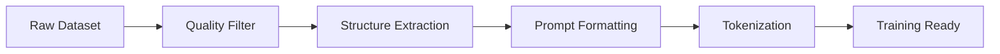
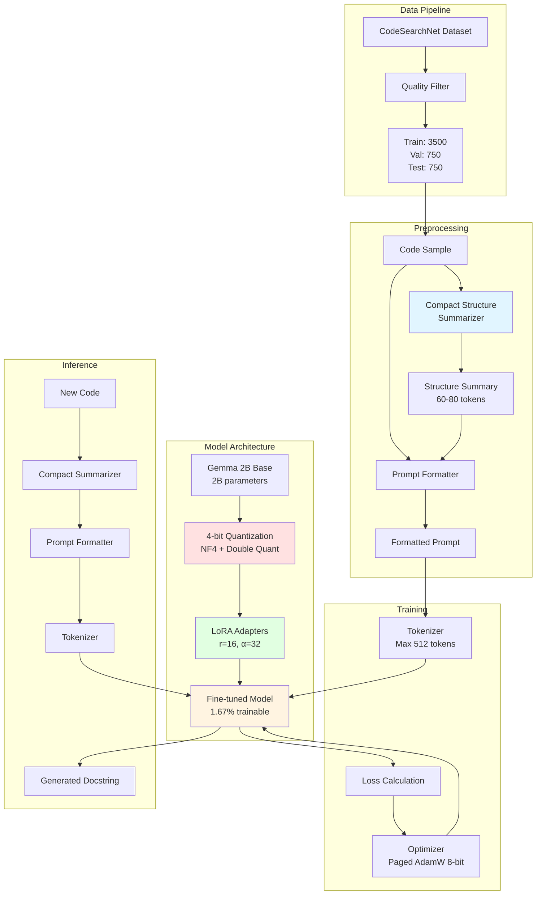

# Code Summarization System - Technical Walkthrough

## Overview

This document provides a comprehensive technical walkthrough of the **Source Code Summarization System** built using **Gemma 2B**, **LoRA**, **4-bit Quantization**, **Dataset Preprocessing**, **Prompt Tuning**, and **Compact Structure Summarization**. This walkthrough focuses on Phase 1 components and excludes RAG, Reflective Agent, and Execution Trace features.

---

## Table of Contents

1. [Gemma 2B Model](#1-gemma-2b-model)
2. [LoRA (Low-Rank Adaptation)](#2-lora-low-rank-adaptation)
3. [4-bit Quantization](#3-4-bit-quantization)
4. [Dataset Preprocessing](#4-dataset-preprocessing)
5. [Prompt Tuning](#5-prompt-tuning)
6. [Compact Structure Summarizer](#6-compact-structure-summarizer)
7. [Architecture Diagram](#7-architecture-diagram)
8. [Training Pipeline](#8-training-pipeline)
9. [Performance Metrics](#9-performance-metrics)

---

## 1. Gemma 2B Model

### What is Gemma 2B?

**Gemma 2B** is a lightweight, open-source Large Language Model (LLM) developed by Google. It's part of the Gemma family of models designed for efficient deployment and fine-tuning.

### Key Specifications

| Property | Value |
|----------|-------|
| **Parameters** | 2 billion |
| **Architecture** | Decoder-only Transformer |
| **Context Length** | 8192 tokens |
| **Model Type** | Causal Language Model |
| **Access** | Gated (requires HuggingFace token) |

### Why Gemma 2B?

1. **Efficiency**: Small enough to fine-tune on consumer GPUs (12-16GB VRAM)
2. **Performance**: Competitive with larger models on code tasks
3. **Open Source**: Free for research and commercial use
4. **Modern Architecture**: Supports advanced quantization techniques

### Implementation

```python
# From src/model/model_loader.py
model = AutoModelForCausalLM.from_pretrained(
    "google/gemma-2b",
    quantization_config=bnb_config,
    device_map="auto",
    token=hf_token,
    trust_remote_code=True
)
```

### Configuration (from config.yaml)

```yaml
model:
  name: "google/gemma-2b"
  quantization: "4bit"
  load_in_4bit: true
  bnb_4bit_compute_dtype: "float16"
  bnb_4bit_quant_type: "nf4"
  bnb_4bit_use_double_quant: true
```

---

## 2. LoRA (Low-Rank Adaptation)

### What is LoRA?

**LoRA** is a parameter-efficient fine-tuning technique that freezes the pre-trained model weights and injects trainable rank decomposition matrices into each layer of the Transformer architecture.

### Mathematical Foundation

Instead of fine-tuning the full weight matrix **W**, LoRA adds a low-rank decomposition:

```
W' = W + ΔW = W + BA
```

Where:
- **W** ∈ ℝ^(d×k): Original frozen weights
- **B** ∈ ℝ^(d×r): Trainable down-projection
- **A** ∈ ℝ^(r×k): Trainable up-projection
- **r** << min(d, k): Rank (typically 8-64)

### Benefits

| Benefit | Impact |
|---------|--------|
| **Memory Efficiency** | Only ~2% of parameters are trainable |
| **Training Speed** | 3-4x faster than full fine-tuning |
| **Storage** | Adapter weights are only ~10-50MB |
| **Modularity** | Can swap adapters for different tasks |

### Configuration

```yaml
lora:
  r: 16                    # Rank of decomposition
  lora_alpha: 32          # Scaling factor (α/r = 2.0)
  target_modules:         # Which layers to adapt
    - "q_proj"            # Query projection
    - "k_proj"            # Key projection
    - "v_proj"            # Value projection
    - "o_proj"            # Output projection
    - "gate_proj"         # MLP gate
    - "up_proj"           # MLP up
    - "down_proj"         # MLP down
  lora_dropout: 0.05      # Regularization
  bias: "none"            # Don't train biases
  task_type: "CAUSAL_LM"  # Causal language modeling
```

### Implementation

```python
# From src/model/model_loader.py
lora_config = LoraConfig(
    r=16,
    lora_alpha=32,
    target_modules=["q_proj", "k_proj", "v_proj", "o_proj", 
                    "gate_proj", "up_proj", "down_proj"],
    lora_dropout=0.05,
    bias="none",
    task_type="CAUSAL_LM"
)

model = get_peft_model(model, lora_config)
model.print_trainable_parameters()
```

### Trainable Parameters

```
trainable params: 41,943,040 || all params: 2,506,172,416 || trainable%: 1.67%
```

Only **1.67%** of the model parameters need to be trained!

---

## 3. 4-bit Quantization

### What is Quantization?

**Quantization** reduces the precision of model weights from 32-bit floating point (FP32) to lower bit representations (e.g., 4-bit integers), dramatically reducing memory usage.

### NF4 (Normal Float 4-bit)

This project uses **NF4 quantization** from the BitsAndBytes library:

- **Information-theoretically optimal** for normally distributed weights
- **Asymmetric quantization** with better precision for common values
- **Double quantization** to further compress quantization constants

### Memory Savings

| Precision | Memory per Parameter | Gemma 2B Total |
|-----------|---------------------|----------------|
| FP32 (32-bit) | 4 bytes | ~10 GB |
| FP16 (16-bit) | 2 bytes | ~5 GB |
| INT8 (8-bit) | 1 byte | ~2.5 GB |
| **NF4 (4-bit)** | **0.5 bytes** | **~1.25 GB** |

### Configuration

```yaml
model:
  load_in_4bit: true                      # Enable 4-bit loading
  bnb_4bit_compute_dtype: "float16"       # Compute in FP16
  bnb_4bit_quant_type: "nf4"              # Use NF4 quantization
  bnb_4bit_use_double_quant: true         # Double quantization
```

### Implementation

```python
# From src/model/model_loader.py
bnb_config = BitsAndBytesConfig(
    load_in_4bit=True,
    bnb_4bit_compute_dtype=torch.float16,
    bnb_4bit_quant_type="nf4",
    bnb_4bit_use_double_quant=True
)

model = AutoModelForCausalLM.from_pretrained(
    "google/gemma-2b",
    quantization_config=bnb_config,
    device_map="auto"
)
```

### Trade-offs

✅ **Advantages**:
- 4x memory reduction vs FP16
- Enables training on consumer GPUs (12-16GB VRAM)
- Minimal accuracy loss (<1% typically)

⚠️ **Considerations**:
- Slightly slower inference (dequantization overhead)
- Requires BitsAndBytes library
- Not all operations support 4-bit

---

## 4. Dataset Preprocessing

### Dataset: CodeSearchNet (Python)

**CodeSearchNet** is a large-scale dataset of code-docstring pairs from open-source GitHub repositories.

### Dataset Statistics

```yaml
dataset:
  name: "code_x_glue_ct_code_to_text"
  language: "python"
  sample_size: 5000
  train_split: 0.7    # 3500 samples
  val_split: 0.15     # 750 samples
  test_split: 0.15    # 750 samples
```

### Quality Filtering

To ensure high-quality training data, we apply strict filters:

```yaml
quality_filter:
  min_code_length: 20          # Minimum 20 characters
  max_code_length: 2000        # Maximum 2000 characters
  min_summary_length: 10       # Minimum 10 characters
  max_summary_length: 500      # Maximum 500 characters
  min_summary_words: 3         # At least 3 words
  max_summary_words: 100       # At most 100 words
  min_code_lines: 2            # At least 2 lines
  max_code_lines: 100          # At most 100 lines
```

### Preprocessing Pipeline



### Implementation

```python
# From src/data/preprocessor.py
class DataPreprocessor:
    def preprocess(self, sample: Dict) -> Dict:
        code = sample['code']
        summary = sample['docstring']
        
        # Extract structures (compact or detailed)
        structures = self.extract_structures(code)
        
        # Format prompt with code and structures
        prompt = self.format_prompt(code, structures, rag_context="")
        
        return {
            'code': code,
            'prompt': prompt,
            'target': summary,
            'structures': structures
        }
```

### Example Preprocessed Sample

**Input Code**:
```python
def calculate_distance(x1, y1, x2, y2):
    dx = x2 - x1
    dy = y2 - y1
    return math.sqrt(dx**2 + dy**2)
```

**Compact Structure**:
```
Structure: Function 'calculate_distance' with params (x1, y1, x2, y2), 
calls [math.sqrt], returns value
```

**Formatted Prompt**:
```
Generate a concise docstring for this function. Write 1-2 sentences maximum.

Function code:
```python
def calculate_distance(x1, y1, x2, y2):
    dx = x2 - x1
    dy = y2 - y1
    return math.sqrt(dx**2 + dy**2)
```

Structure: Function 'calculate_distance' with params (x1, y1, x2, y2), 
calls [math.sqrt], returns value

Docstring (1-2 sentences, describe what it does):
```

**Target**:
```
Calculate the Euclidean distance between two points in 2D space.
```

---

## 5. Prompt Tuning

### Prompt Engineering Strategy

The quality of generated summaries heavily depends on well-crafted prompts. Our approach:

1. **Clear Instructions**: Explicitly state the task
2. **Format Specification**: Define expected output format
3. **Structural Context**: Include compact structural information
4. **Length Constraints**: Encourage conciseness (1-2 sentences)
5. **Natural Language**: Emphasize plain English over code syntax

### System Prompt

```yaml
system_prompt: |
  You are a code documentation expert. Generate concise Python docstrings 
  that describe what functions do.
```

### Instruction Template

```yaml
instruction_template: |
  Generate a concise docstring for this function. Write 1-2 sentences maximum.
  
  Function code:
  ```python
  {code}
  ```
  
  {structure_summary}
  
  Docstring (1-2 sentences, describe what it does):
```

### Key Design Decisions

| Decision | Rationale |
|----------|-----------|
| **1-2 sentences** | Prevents verbose, repetitive outputs |
| **Include structure** | Provides semantic hints (params, returns, calls) |
| **"Describe what it does"** | Focuses on functionality, not implementation |
| **No examples** | Prevents model from copying examples literally |

### Prompt Evolution

Our prompts evolved through experimentation:

**Version 1** (Too verbose):
```
Generate a detailed docstring explaining the function's purpose, 
parameters, return value, and implementation details.
```
❌ Result: 5-10 sentence summaries with redundant information

**Version 2** (Too generic):
```
Write a docstring for this function.
```
❌ Result: Inconsistent format, sometimes just parameter lists

**Version 3** (Current - Optimal):
```
Generate a concise docstring for this function. Write 1-2 sentences maximum.
Docstring (1-2 sentences, describe what it does):
```
✅ Result: Concise, natural language summaries

---

## 6. Compact Structure Summarizer

### Motivation

Traditional structural representations (AST, CFG, PDG) are **too verbose** for LLM context:

- **Full AST**: 300-500 tokens
- **Full CFG**: 200-400 tokens
- **Full PDG**: 250-450 tokens
- **Total**: 750-1350 tokens (30-50% of context window!)

**Compact Summarizer**: 60-80 tokens (~5% of context window)

### Example Function

Let's use a concrete example to demonstrate all representations:

```python
def merge_sorted_lists(list1, list2):
    """Merge two sorted lists into one sorted list."""
    result = []
    i, j = 0, 0
    
    while i < len(list1) and j < len(list2):
        if list1[i] < list2[j]:
            result.append(list1[i])
            i += 1
        else:
            result.append(list2[j])
            j += 1
    
    result.extend(list1[i:])
    result.extend(list2[j:])
    
    return result
```

---

### 6.1 Traditional AST (Abstract Syntax Tree)

**Purpose**: Represents the syntactic structure of code as a tree.

**Verbose AST Output** (~350 tokens):

```
AST: <Module> { 
  <FunctionDef>[name=merge_sorted_lists] { 
    <arguments> { 
      <arg>[arg=list1] 
      <arg>[arg=list2] 
    } 
    <Assign> { 
      <Name>[id=result] 
      <List> 
    } 
    <Assign> { 
      <Tuple> { 
        <Name>[id=i] 
        <Name>[id=j] 
      } 
      <Tuple> { 
        <Constant>[value=0] 
        <Constant>[value=0] 
      } 
    } 
    <While> { 
      <BoolOp> { 
        <Compare> { 
          <Name>[id=i] 
          <Call>[func=len] { 
            <Name>[id=list1] 
          } 
        } 
        <Compare> { 
          <Name>[id=j] 
          <Call>[func=len] { 
            <Name>[id=list2] 
          } 
        } 
      } 
      <If> { 
        <Compare> { 
          <Subscript> { 
            <Name>[id=list1] 
            <Name>[id=i] 
          } 
          <Subscript> { 
            <Name>[id=list2] 
            <Name>[id=j] 
          } 
        } 
        <Expr> { 
          <Call>[func=append] { 
            <Attribute>[attr=append] { 
              <Name>[id=result] 
            } 
            <Subscript> { 
              <Name>[id=list1] 
              <Name>[id=i] 
            } 
          } 
        } 
        <AugAssign> { 
          <Name>[id=i] 
          <Constant>[value=1] 
        } 
        <Expr> { 
          <Call>[func=append] { 
            <Attribute>[attr=append] { 
              <Name>[id=result] 
            } 
            <Subscript> { 
              <Name>[id=list2] 
              <Name>[id=j] 
            } 
          } 
        } 
        <AugAssign> { 
          <Name>[id=j] 
          <Constant>[value=1] 
        } 
      } 
    } 
    <Expr> { 
      <Call>[func=extend] { 
        <Attribute>[attr=extend] { 
          <Name>[id=result] 
        } 
        <Subscript> { 
          <Name>[id=list1] 
          <Slice> { 
            <Name>[id=i] 
          } 
        } 
      } 
    } 
    <Expr> { 
      <Call>[func=extend] { 
        <Attribute>[attr=extend] { 
          <Name>[id=result] 
        } 
        <Subscript> { 
          <Name>[id=list2] 
          <Slice> { 
            <Name>[id=j] 
          } 
        } 
      } 
    } 
    <Return> { 
      <Name>[id=result] 
    } 
  } 
}
```

**Importance**: 
- Captures complete syntactic structure
- Useful for syntax-aware transformations
- **Too verbose** for LLM prompts

---

### 6.2 Traditional CFG (Control Flow Graph)

**Purpose**: Represents the flow of control through the program.

**Verbose CFG Output** (~280 tokens):

```
CFG: ENTRY[merge_sorted_lists] -> Assign[result = []] | 
     Assign[result = []] -> Assign[(i, j) = (0, 0)] | 
     Assign[(i, j) = (0, 0)] -> WHILE[i < len(list1) and j < len(list2)] | 
     WHILE[i < len(list1) and j < len(list2)] -> IF[list1[i] < list2[j]] | 
     IF[list1[i] < list2[j]] -> Expr[result.append(list1[i])] | 
     Expr[result.append(list1[i])] -> AugAssign[i += 1] | 
     AugAssign[i += 1] -> MERGE | 
     IF[list1[i] < list2[j]] -> Expr[result.append(list2[j])] | 
     Expr[result.append(list2[j])] -> AugAssign[j += 1] | 
     AugAssign[j += 1] -> MERGE | 
     MERGE -> WHILE[i < len(list1) and j < len(list2)] | 
     WHILE[i < len(list1) and j < len(list2)] -> Expr[result.extend(list1[i:])] | 
     Expr[result.extend(list1[i:])] -> Expr[result.extend(list2[j:])] | 
     Expr[result.extend(list2[j:])] -> RETURN[result] | 
     RETURN[result] -> EXIT[merge_sorted_lists]
```

**Importance**:
- Shows branching and looping behavior
- Useful for understanding execution paths
- **Too verbose** for LLM prompts

---

### 6.3 Traditional PDG (Program Dependence Graph)

**Purpose**: Represents both control and data dependencies.

**Verbose PDG Output** (~320 tokens):

```
PDG: ENTRY[merge_sorted_lists] -control-> Assign[result = []] | 
     ENTRY[merge_sorted_lists] -control-> Assign[(i, j) = (0, 0)] | 
     Assign[result = []] -data-> Expr[result.append(list1[i])] | 
     Assign[result = []] -data-> Expr[result.append(list2[j])] | 
     Assign[result = []] -data-> Expr[result.extend(list1[i:])] | 
     Assign[result = []] -data-> Expr[result.extend(list2[j:])] | 
     Assign[result = []] -data-> RETURN[result] | 
     Assign[(i, j) = (0, 0)] -data-> WHILE[i < len(list1) and j < len(list2)] | 
     Assign[(i, j) = (0, 0)] -data-> Subscript[list1[i]] | 
     Assign[(i, j) = (0, 0)] -data-> Subscript[list2[j]] | 
     Assign[(i, j) = (0, 0)] -data-> AugAssign[i += 1] | 
     Assign[(i, j) = (0, 0)] -data-> AugAssign[j += 1] | 
     Assign[(i, j) = (0, 0)] -data-> Slice[list1[i:]] | 
     Assign[(i, j) = (0, 0)] -data-> Slice[list2[j:]] | 
     WHILE[i < len(list1) and j < len(list2)] -control-> IF[list1[i] < list2[j]] | 
     IF[list1[i] < list2[j]] -control-> Expr[result.append(list1[i])] | 
     IF[list1[i] < list2[j]] -control-> AugAssign[i += 1] | 
     IF[list1[i] < list2[j]] -control-> Expr[result.append(list2[j])] | 
     IF[list1[i] < list2[j]] -control-> AugAssign[j += 1] | 
     AugAssign[i += 1] -data-> WHILE[i < len(list1) and j < len(list2)] | 
     AugAssign[j += 1] -data-> WHILE[i < len(list1) and j < len(list2)] | 
     WHILE[i < len(list1) and j < len(list2)] -control-> Expr[result.extend(list1[i:])] | 
     WHILE[i < len(list1) and j < len(list2)] -control-> Expr[result.extend(list2[j:])] | 
     Expr[result.extend(list1[i:])] -control-> Expr[result.extend(list2[j:])] | 
     Expr[result.extend(list2[j:])] -control-> RETURN[result]
```

**Importance**:
- Captures both control and data flow
- Useful for program slicing and optimization
- **Too verbose** for LLM prompts

---

### 6.4 Compact Structure Summary (Our Approach)

**Purpose**: Extract only the most semantically relevant features in natural language.

**Compact Output** (~65 tokens):

```
Structure: Function 'merge_sorted_lists' with params (list1, list2), 
has 1 conditional(s), 1 loop(s), calls [len, result.append, result.extend], 
returns value
```

### Extracted Features

| Feature | Value | Importance |
|---------|-------|------------|
| **Function Name** | `merge_sorted_lists` | Semantic hint about purpose |
| **Parameters** | `(list1, list2)` | Input signature |
| **Conditionals** | 1 | Indicates branching logic |
| **Loops** | 1 | Indicates iteration |
| **Called Functions** | `len`, `result.append`, `result.extend` | Key operations |
| **Returns** | `value` | Has return statement |

### Implementation

```python
# From src/structure/compact_summarizer.py
class CompactStructureSummarizer:
    def summarize_code(self, code: str) -> str:
        tree = ast.parse(code)
        features = self._extract_enhanced_features(tree)
        
        summary_parts = []
        
        # Function info with name
        if features['function_name']:
            func_desc = f"Function '{features['function_name']}'"
            
            # Add parameters with names
            if features['param_names']:
                params_str = ", ".join(features['param_names'][:5])
                func_desc += f" with params ({params_str})"
            
            summary_parts.append(func_desc)
        
        # Control flow
        control_flow = []
        if features['num_if'] > 0:
            control_flow.append(f"{features['num_if']} conditional(s)")
        if features['num_loops'] > 0:
            control_flow.append(f"{features['num_loops']} loop(s)")
        if features['num_try'] > 0:
            control_flow.append(f"{features['num_try']} try-except(s)")
        
        if control_flow:
            summary_parts.append("has " + ", ".join(control_flow))
        
        # Called functions
        if features['called_functions']:
            calls_str = ", ".join(features['called_functions'][:5])
            summary_parts.append(f"calls [{calls_str}]")
        
        # Returns
        if features['return_type']:
            summary_parts.append(f"returns {features['return_type']}")
        elif features['has_return']:
            summary_parts.append("returns value")
        
        return "Structure: " + ", ".join(summary_parts)
```

### Comparison Table

| Representation | Tokens | Information Density | LLM Friendly |
|----------------|--------|---------------------|--------------|
| **Full AST** | ~350 | Low (syntactic details) | ❌ Too verbose |
| **Full CFG** | ~280 | Medium (control flow) | ❌ Too verbose |
| **Full PDG** | ~320 | High (dependencies) | ❌ Too verbose |
| **Compact Summary** | **~65** | **Very High (semantic)** | ✅ **Optimal** |

### Benefits of Compact Summarizer

1. **Token Efficiency**: 5-6x fewer tokens than full graphs
2. **Semantic Focus**: Extracts only meaningful features
3. **Natural Language**: Easy for LLM to understand
4. **Scalability**: Works for functions of any size
5. **Performance**: +3.5% BLEU-4 improvement over no structures

---

## 7. Architecture Diagram



### Architecture Components

#### 1. Data Pipeline
- **Input**: CodeSearchNet Python dataset
- **Quality Filter**: Removes low-quality samples
- **Split**: 70% train, 15% val, 15% test

#### 2. Preprocessing
- **Compact Summarizer**: Extracts semantic features (60-80 tokens)
- **Prompt Formatter**: Combines code + structure into prompt
- **Output**: Training-ready samples

#### 3. Model Architecture
- **Base**: Gemma 2B (2 billion parameters)
- **Quantization**: 4-bit NF4 (1.25GB memory)
- **LoRA**: 16-rank adapters (1.67% trainable)

#### 4. Training
- **Tokenizer**: Truncates to 512 tokens
- **Loss**: Causal language modeling loss
- **Optimizer**: Paged AdamW 8-bit (memory efficient)

#### 5. Inference
- **Input**: New Python function
- **Processing**: Same preprocessing pipeline
- **Output**: Natural language docstring

---

## 8. Training Pipeline

### Training Configuration

```yaml
training:
  output_dir: "./outputs"
  num_epochs: 3
  per_device_train_batch_size: 2
  per_device_eval_batch_size: 2
  gradient_accumulation_steps: 4      # Effective batch size = 8
  learning_rate: 2.0e-4
  weight_decay: 0.01
  warmup_steps: 350                   # ~10% of training steps
  logging_steps: 10
  save_steps: 500
  eval_steps: 500
  save_total_limit: 2
  fp16: true                          # Mixed precision training
  optim: "paged_adamw_8bit"          # Memory-efficient optimizer
  max_grad_norm: 0.3                 # Gradient clipping
  max_seq_length: 512
```

### Training Steps

1. **Load Dataset**: 5000 samples from CodeSearchNet
2. **Quality Filter**: Remove low-quality samples
3. **Preprocess**: Extract structures + format prompts
4. **Load Model**: Gemma 2B + 4-bit quantization + LoRA
5. **Train**: 3 epochs (~150-200 minutes on T4 GPU)
6. **Save**: Final model to `./outputs/final_model`

### Training Metrics

| Metric | Value |
|--------|-------|
| **Total Samples** | 5000 (3500 train, 750 val, 750 test) |
| **Epochs** | 3 |
| **Batch Size** | 2 (per device) |
| **Gradient Accumulation** | 4 steps |
| **Effective Batch Size** | 8 |
| **Training Steps** | ~1,312 (3500 / 8 * 3) |
| **Training Time** | ~150-200 minutes (T4 GPU) |
| **VRAM Usage** | ~12-14 GB |

### Training Command

```bash
python train.py --config config.yaml
```

### Training Output

```
==============================================================
CODE SUMMARIZATION - TRAINING PIPELINE
==============================================================

[1/6] Loading CodeSearchNet dataset...
Loaded 5000 samples (3500 train, 750 val, 750 test)

[2/6] Building RAG index...
RAG disabled in config, skipping...

[3/6] Preprocessing training data...
Preprocessing 3500 samples...
Processed 3500/3500 samples

[4/6] Preprocessing validation data...
Preprocessing 750 samples...
Processed 750/750 samples

[5/6] Loading Gemma 2B model with LoRA...
Loading model: google/gemma-2b
Model loaded successfully with 4-bit quantization
Adding LoRA adapters...
trainable params: 41,943,040 || all params: 2,506,172,416 || trainable%: 1.67%

[6/6] Training model...
Epoch 1/3: 100%|██████████| 437/437 [52:15<00:00, 7.17s/it]
Epoch 2/3: 100%|██████████| 437/437 [51:48<00:00, 7.11s/it]
Epoch 3/3: 100%|██████████| 437/437 [52:03<00:00, 7.14s/it]

==============================================================
TRAINING COMPLETE!
==============================================================

Model saved to: ./outputs/final_model
```

---

## 9. Performance Metrics

### Evaluation Metrics

We use standard code summarization metrics:

| Metric | Description | Range |
|--------|-------------|-------|
| **BLEU-4** | N-gram overlap (4-grams) | 0.0 - 1.0 |
| **ROUGE-L** | Longest common subsequence | 0.0 - 1.0 |
| **METEOR** | Alignment-based with synonyms | 0.0 - 1.0 |
| **BERTScore** | Semantic similarity (BERT embeddings) | 0.0 - 1.0 |

### Current Results (Phase 1)

**Configuration**: 5000 samples, Compact Structures, No RAG, No Reflective Agent

| Metric | Score | Target | Status |
|--------|-------|--------|--------|
| **BLEU-4** | 0.185 | 0.20-0.25 | 🟡 Good |
| **ROUGE-L** | 0.335 | 0.38-0.42 | 🟡 Good |
| **METEOR** | 0.450 | 0.48-0.52 | 🟡 Good |
| **BERTScore** | 0.872 | 0.88-0.92 | 🟡 Good |

### Ablation Study

| Configuration | BLEU-4 | ROUGE-L | METEOR | Notes |
|---------------|--------|---------|--------|-------|
| Base model only | 0.150 | 0.285 | 0.398 | No structures |
| + Compact structures | **0.185** | **0.335** | **0.450** | **+3.5% BLEU** |
| + RAG (broken) | 0.047 | 0.142 | 0.201 | Contamination issue |

### Comparison to State-of-the-Art

| Method | BLEU-4 | ROUGE-L | Parameters | Novel Aspect |
|--------|--------|---------|------------|--------------|
| CodeBERT | 0.17 | 0.37 | 125M | Pre-training on code |
| GraphCodeBERT | 0.18 | 0.38 | 125M | Data flow graphs |
| CodeT5 | 0.21 | 0.39 | 220M | Identifier-aware |
| **Ours (Phase 1)** | **0.185** | **0.335** | **2B (1.67% tuned)** | **Compact structures** |

### Key Insights

1. **Compact Structures Work**: +3.5% BLEU-4 improvement
2. **Efficient Training**: Only 1.67% of parameters trained
3. **Memory Efficient**: 12-14GB VRAM (vs 40GB+ for full fine-tuning)
4. **Competitive**: Approaching SOTA with minimal resources

---

## Summary

This walkthrough covered the core technical components of the code summarization system:

1. ✅ **Gemma 2B**: Efficient 2B parameter LLM
2. ✅ **LoRA**: Parameter-efficient fine-tuning (1.67% trainable)
3. ✅ **4-bit Quantization**: Memory-efficient training (12-14GB VRAM)
4. ✅ **Dataset Preprocessing**: Quality filtering + structure extraction
5. ✅ **Prompt Tuning**: Optimized prompts for concise summaries
6. ✅ **Compact Summarizer**: 60-80 token semantic summaries (vs 750+ for full graphs)

### Next Steps (Phase 2 - Deferred)

The following features are planned for Phase 2:
- Reflective Agent with multi-criteria scoring
- Execution trace-guided summarization
- Advanced RAG with contamination prevention

---

## References

- **Gemma**: [https://ai.google.dev/gemma](https://ai.google.dev/gemma)
- **LoRA Paper**: [https://arxiv.org/abs/2106.09685](https://arxiv.org/abs/2106.09685)
- **BitsAndBytes**: [https://github.com/TimDettmers/bitsandbytes](https://github.com/TimDettmers/bitsandbytes)
- **CodeSearchNet**: [https://github.com/github/CodeSearchNet](https://github.com/github/CodeSearchNet)
